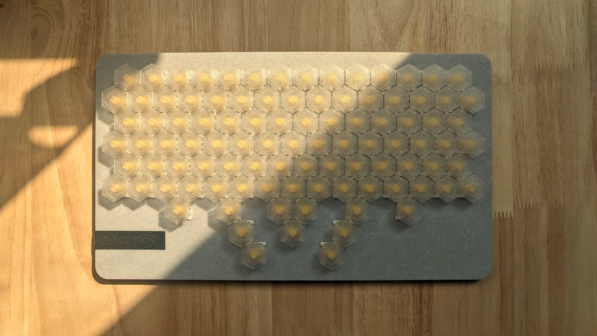
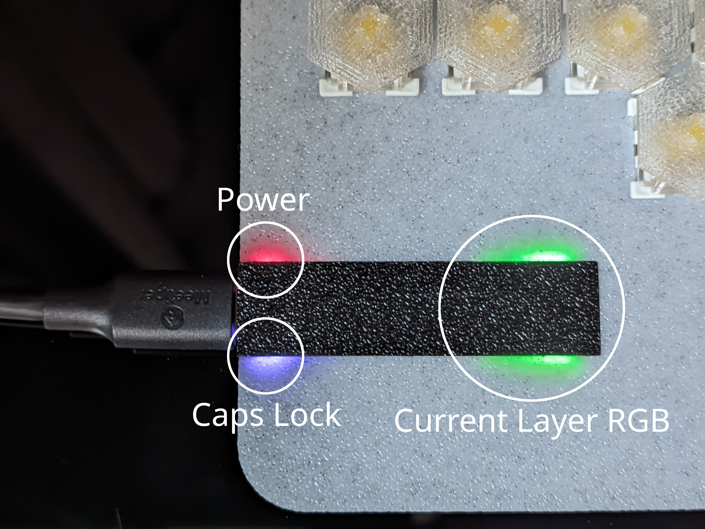
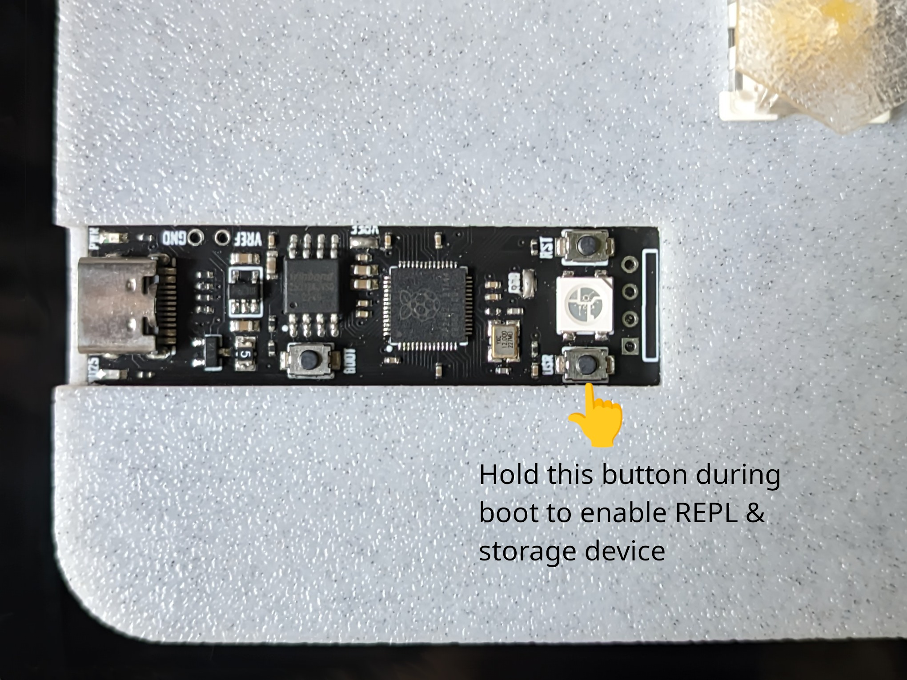

# hex98

## BOM

| Description      | Qty |
| ---------------- | --- |
| M3*6 FHCS        | 11  |
| MX Switchs       | 98  |
| [YD-RP2040](ali) | 1   |

[ali]: https://www.aliexpress.us/item/3256803817805852.html

## LED indicator

## Firmware

See [firmware/kmk](firmware/kmk)

## How to enter dev mode after firmware flashed?

