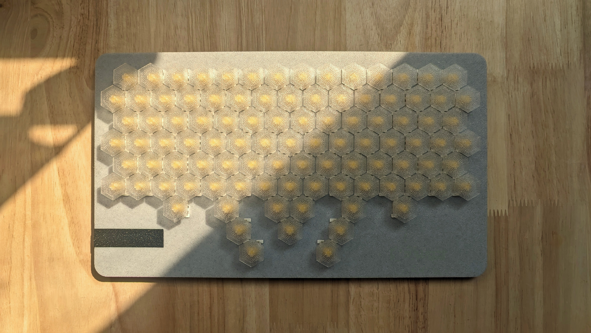

# hex98

 My honeycomb keyboard
 
## Why?

- Minimized learning curve
  - Almost a QWERTY keyboard, with additional thumb keys
- Ergonomics
  - Keys are 60°, keeps wrists straight, see finger placement below
- Six thumb keys
  - Pinky is weak, modifier keys are moved to thumb
- Plenty of keys
  - Move your hands instead of switching layers

## Finger Placement

## BOM

| Description      | Qty |
| ---------------- | --- |
| M3*6 FHCS        | 11  |
| MX Switchs       | 98  |
| [YD-RP2040][ali] | 1   |

[ali]: https://www.aliexpress.us/item/3256803817805852.html

## Build guide

Download all step files from `cad/out`, print them

The `keyboard_body` is 306mm*174.73mm, make sure your 3D printer is big enough

`wrist_rest` is optional, print two if you need

***TBD***

## Firmware

See [firmware/kmk](firmware/kmk)

## Q&A

### What do these indicator LEDs mean？

Power LED is always on

Current Layer RGB is off on default layer, yellow on second layer, green on third layer

Colors can be customized via https://github.com/iovxw/hex98/blob/5d3e64cad47163fc65e81f1292481ab168c750fa/firmware/kmk/main.py#L25

### How to enter dev mode after firmware flashed?

